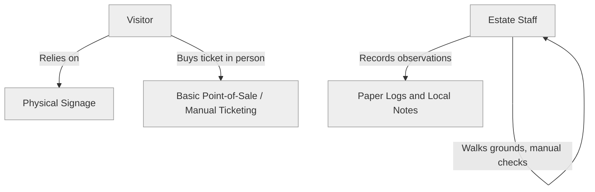

# Current state

This document describes the estate's operations **today**, before any part of this
solution is built. It exists so that [target-state.md](target-state.md) can be
read as a deliberate change, not an assumed starting point.

## Summary

Von Digitalis Estates does not currently operate a digital ticketing, telemetry or
analytics system (assumption A1 in [../docs/assumptions.md](../docs/assumptions.md)).
Operations are run manually:

- **Ticketing and access**: assumed to be manual or, at best, a basic point-of-sale
  system with no connection to attraction or zone data.
- **Ride and enclosure monitoring**: assumed to rely on staff walking the grounds
  and periodic manual checks; no continuous telemetry exists.
- **Animal care**: keeper observations are assumed to be recorded on paper or in
  disconnected local notes, without systematic correlation to environmental
  conditions.
- **Visitor experience**: no app or portal exists; visitors navigate using signage
  and staff guidance only.
- **Demand and popularity data**: not collected in any systematic, queryable form.

## Why this matters for the target design

Because there is no existing system to migrate, [target-state.md](target-state.md)
is a greenfield design. This has two consequences reflected throughout the
architecture:

1. There is no legacy data or integration constraint to preserve — component names
   and boundaries can be chosen for the target problem, not to interoperate with an
   existing system.
2. There is no historical data available on day one. AI capabilities described in
   [../use-cases/](../use-cases/) must be designed to start with limited data and
   improve as the operational backbone described here accumulates it (see
   assumption D4 in [../docs/assumptions.md](../docs/assumptions.md)).

## Current-state diagram

No data from ticketing, staff observations or ride/enclosure checks is
systematically captured, connected or analysed today. This is the gap the target
architecture closes.
