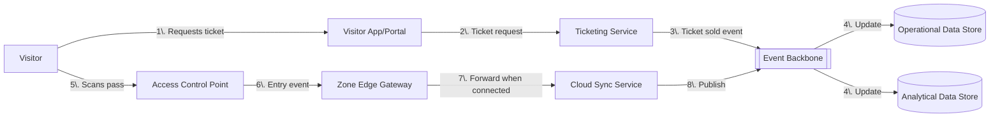
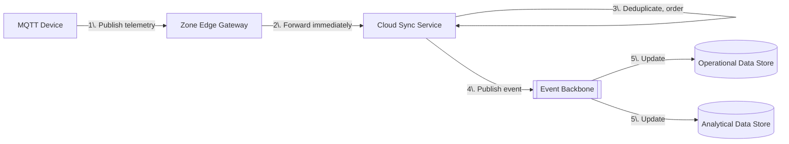
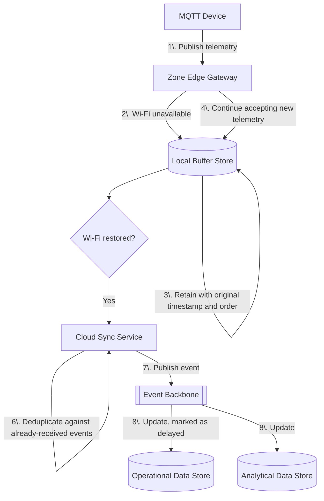
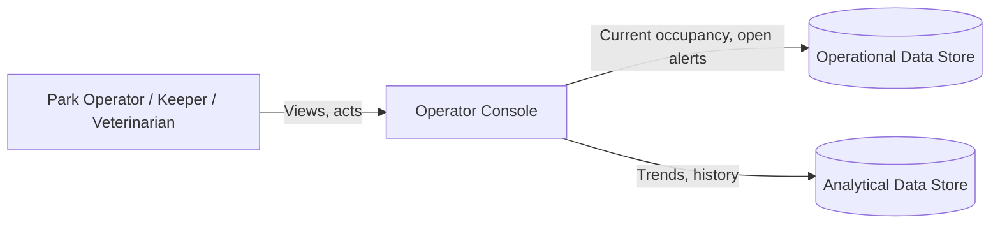

# Data flow

This document traces how data moves through the baseline architecture described
in [target-state.md](target-state.md), with particular attention to the case that
matters most for this estate: **an intermittent Wi-Fi connection**. Component
names match [target-state.md](target-state.md).

## Flow 1: Ticket purchase and entry

A visitor buys a ticket and enters the estate.

This flow is entirely within the cloud platform except for the Access Control
Point, which sits in a zone and is therefore subject to Wi-Fi gaps — hence step 6
goes through the same Zone Edge Gateway as other zone telemetry, not directly to
the cloud.

## Flow 2: MQTT telemetry during normal connectivity

A ride or enclosure sensor publishes telemetry while the zone's Wi-Fi is
available.

## Flow 3: MQTT telemetry during a Wi-Fi outage (the critical path)

This is the flow the architecture is explicitly designed around (resilience
characteristic in
[../docs/architecture-characteristics.md](../docs/architecture-characteristics.md)).

Key properties of this flow, required by OE1 and OE4 in
[../docs/requirements.md](../docs/requirements.md):

- The Zone Edge Gateway never blocks or drops new telemetry because of a Wi-Fi
  outage; it keeps buffering locally.
- Original event timestamps and ordering are preserved in the Local Buffer Store,
  so downstream consumers (including future AI capabilities) can reconstruct the
  true sequence of events even though they arrive late.
- The Cloud Sync Service is responsible for deduplication, since a gateway may
  retry forwarding after a partial failure.
- Data updated from a delayed/buffered batch is marked as such in the
  Operational Data Store, so operators and any AI capability can distinguish
  "fresh" from "recently caught up" data — this supports the explainability and
  data-integrity characteristics described in
  [../docs/architecture-characteristics.md](../docs/architecture-characteristics.md).

## Flow 4: Operator and keeper access to data

Operators, keepers and veterinarians consume both operational and analytical
data through a single interface.

No AI component appears in this baseline data flow. Once the AI use cases are
layered on top (see [../use-cases/](../use-cases/)), they read from the Event
Backbone and Analytical Data Store and write recommendations/alerts back into the
Operational Data Store for the Operator Console and Visitor App/Portal to
surface — the data-flow shape described here does not change.

## Data ownership summary

| Data | Origin | Primary store | Consumers |
|---|---|---|---|
| Ticket sales | Ticketing Service | Operational Data Store | Visitor App/Portal, Operator Console |
| Entry/exit events | Access Control Point | Operational Data Store, then Analytical Data Store | Operator Console, future Visitor Intelligence |
| Ride/enclosure telemetry | MQTT Device | Operational Data Store (current state), Analytical Data Store (history) | Operator Console, future Animal Health / Visitor Intelligence |
| Keeper observations | Operator Console input | Operational Data Store | Operator Console, future Animal Health Intelligence |

See [../docs/assumptions.md](../docs/assumptions.md) (D1–D3) for the assumptions
behind these data origins.
