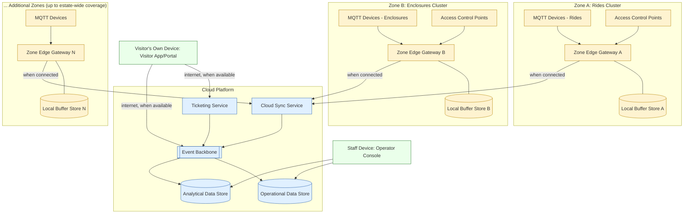

# Deployment view

This document shows where the components from [target-state.md](target-state.md)
physically run: across estate zones, at the estate's local infrastructure, and in
the cloud. It is a logical deployment view — no specific vendor, hosting product
or hardware model is named, per `../AGENT-CONTEXT.md`.

## Deployment zones

The estate is treated as a set of **zones** (a ride cluster, an enclosure
cluster, or a mixed area), each with its own local infrastructure, because
Wi-Fi conditions and device density vary zone to zone. This is consistent with
technical constraint TC4 in [../docs/requirements.md](../docs/requirements.md).

| Location | What runs there | Why |
|---|---|---|
| **Each estate zone** | MQTT Devices, Access Control Points, one Zone Edge Gateway with its Local Buffer Store | Keeps sensing and buffering close to where data is produced, so a Wi-Fi gap in one zone does not affect another |
| **Estate-wide (any connectivity point, e.g. a staff building)** | Operator Console (can also be accessed remotely) | Used by staff who move between zones |
| **Cloud platform** | Cloud Sync Service, Event Backbone, Ticketing Service, Operational Data Store, Analytical Data Store | Centralised services that do not need to run inside the estate and benefit from being reachable from anywhere (visitor app, remote management) |
| **Visitor's own device** | Visitor App/Portal (client) | Visitors bring their own phones; the estate is not expected to provide devices |

## Deployment diagram

**Legend:** Yellow = zone-local infrastructure (in the estate). Blue = cloud
platform. Green = end-user devices, owned by visitors or carried by staff.

## Design implications of this deployment

- **One Zone Edge Gateway per zone**, not a single estate-wide gateway, so a
  hardware or connectivity failure in one zone is isolated (supports the
  resilience characteristic in
  [../docs/architecture-characteristics.md](../docs/architecture-characteristics.md)).
- **Local Buffer Store is co-located with its gateway**, not shared across
  zones, avoiding a single point of failure for buffered data across the whole
  estate.
- **The Operator Console is not tied to a fixed location**; keepers and
  operators move between zones and need access wherever they are, provided they
  can reach either the local zone network or the cloud platform.
- **The cloud platform hosts only centralised, location-independent services.**
  Nothing in the cloud is required for a single zone's MQTT devices, Access
  Control Points and Zone Edge Gateway to keep capturing and buffering data
  during an outage (OE2 in [../docs/requirements.md](../docs/requirements.md)).
- **Visitor devices are untrusted, internet-dependent clients.** The Visitor
  App/Portal only reaches the cloud platform directly; it does not connect to
  zone-local infrastructure, keeping the estate's internal zone network
  separate from general visitor internet traffic (a security boundary, detailed
  in [security-and-privacy.md](security-and-privacy.md)).

## Scaling from 5,000 to 15,000 daily visitors

This deployment view scales primarily by adding capacity **within** existing
zones (more devices per zone, higher-capacity gateways) and by adding new zones
as the estate opens more areas, rather than by redesigning the deployment
topology. This is a design goal, not a validated measurement — see
[../docs/architecture-characteristics.md](../docs/architecture-characteristics.md)
(scalability) and [../docs/cost-and-value-model.md](../docs/cost-and-value-model.md)
once available.
