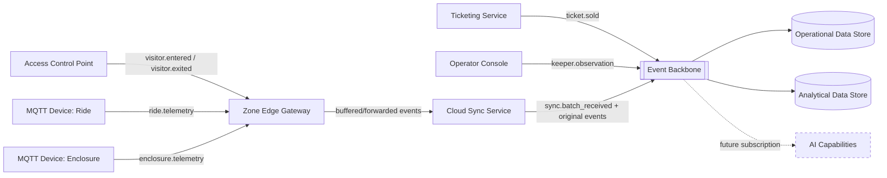

# Event-driven architecture

This document explains why the baseline architecture in
[target-state.md](target-state.md) is built around an **Event Backbone**, and
defines the main event types flowing through it. It does not name a specific
messaging product, per `../AGENT-CONTEXT.md`.

## Why event-driven

The estate has several independent producers of data (ticketing, access control,
MQTT devices across 40 rides and 55 enclosures) and several independent
consumers (operational data store, analytical data store, operator console, and
— later — three separate AI capabilities). An event-driven approach was chosen
over direct point-to-point integration because:

- **Producers and consumers change independently.** New AI capabilities can
  subscribe to existing events without modifying ticketing, access control or
  device firmware.
- **Buffering and replay fit naturally.** Events buffered at the Zone Edge
  Gateway during a Wi-Fi outage (see [data-flow.md](data-flow.md)) can be
  replayed onto the same backbone once connectivity returns, without special
  cases in downstream consumers.
- **Operational and analytical concerns stay separated**, as required by the
  data-integrity and scalability characteristics in
  [../docs/architecture-characteristics.md](../docs/architecture-characteristics.md):
  both the Operational Data Store and Analytical Data Store are just two
  consumers of the same event stream, rather than the analytical store querying
  or depending on the operational store directly.
- **Auditability is easier.** An immutable event log is a natural basis for the
  audit trail required by SPA4 in [../docs/requirements.md](../docs/requirements.md).

This is a logical/architectural decision, not a specific product choice; see
[../adrs/](../adrs/) for any related trade-off recorded as a decision once
written.

## Main event types

| Event type | Produced by | Example payload concerns | Consumed by |
|---|---|---|---|
| `ticket.sold` | Ticketing Service | Pass type, validity, anonymised or pseudonymised visitor reference | Operational Data Store, Analytical Data Store |
| `visitor.entered` / `visitor.exited` | Access Control Point (via Zone Edge Gateway) | Zone, timestamp, anonymised visitor/group reference | Operational Data Store, Analytical Data Store, future Visitor Intelligence |
| `ride.telemetry` | MQTT Device on a ride (via Zone Edge Gateway) | Ride identifier, status, usage counters, timestamp | Operational Data Store, Analytical Data Store |
| `enclosure.telemetry` | MQTT Device on an enclosure (via Zone Edge Gateway) | Enclosure identifier, environmental readings, timestamp | Operational Data Store, Analytical Data Store, future Animal Health Intelligence |
| `keeper.observation` | Operator Console (keeper input) | Enclosure identifier, structured observation, timestamp | Operational Data Store, future Animal Health Intelligence |
| `sync.batch_received` | Cloud Sync Service | Gateway identifier, batch size, delay duration | Operational Data Store (marks data as delayed), monitoring |

All events carry the **original capture timestamp** (set at the Zone Edge
Gateway or Ticketing Service) separately from the **received timestamp** (set by
the Cloud Sync Service), so delayed/buffered events are always distinguishable
from fresh ones — this directly supports OE4 in
[../docs/requirements.md](../docs/requirements.md).

## Event flow diagram

**Legend:** Solid lines are part of the baseline architecture built in this
document set. The dashed line shows how AI capabilities (described in
[../use-cases/](../use-cases/)) will subscribe to the same backbone later,
without changing anything shown here.

## Consistency and ordering

- Events from a single Zone Edge Gateway preserve their original order when
  buffered and forwarded (see [data-flow.md](data-flow.md), Flow 3).
- The Cloud Sync Service deduplicates on a stable event identifier generated at
  the point of capture (device or Access Control Point), not on arrival order,
  so retried forwarding after a partial network failure does not create
  duplicate downstream events.
- Consumers (Operational Data Store, Analytical Data Store, and later AI
  capabilities) are expected to be tolerant of occasional out-of-order delivery
  across different gateways (though not within a single gateway's stream), and
  must use event timestamps rather than arrival order for any time-sensitive
  logic.
