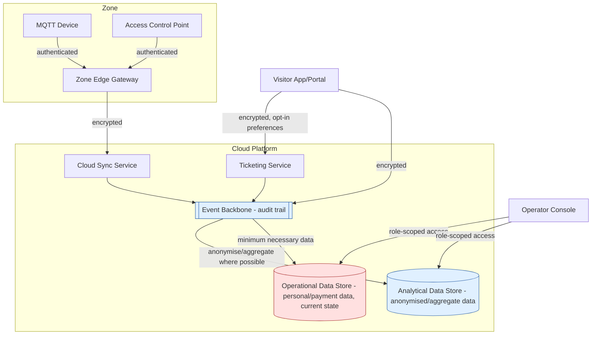

# Security and privacy

This document describes the security and privacy design of the baseline
architecture in [target-state.md](target-state.md), directly implementing the
security/privacy/audit requirements (SPA1–SPA6) in
[../docs/requirements.md](../docs/requirements.md) and the security/privacy
characteristic in
[../docs/architecture-characteristics.md](../docs/architecture-characteristics.md).
It does not name specific security products; see `../AGENT-CONTEXT.md`.

## Visitor personal data

The Ticketing Service and Visitor App/Portal handle personal data: identity
details needed for a pass, payment information, and (only if the visitor opts
in) preference data used for personalisation (see
[../docs/assumptions.md](../docs/assumptions.md), V2).

- Personal and payment data is stored only in the **Operational Data Store**,
  scoped to what is needed to issue and validate a pass — not duplicated into
  the Analytical Data Store.
- Access to personal data is restricted to the services and roles that need it
  (Ticketing Service, Access Control validation); the Operator Console does not
  need, and should not have, direct access to raw personal/payment data to do
  its job of managing rides, enclosures and staffing.
- Preference data used for personalisation (future
  [Personalised Visitor Experience](../use-cases/personalised-visitor-experience.md))
  is collected only with explicit opt-in and is kept separate from the core
  ticketing identity record where possible, to limit the impact of any single
  data exposure.

## Anonymisation of traffic/flow data

Zone occupancy, entry/exit counts and queue-related data (used by
[Visitor Intelligence](../use-cases/visitor-intelligence.md)) do not require
individual visitor identity to be useful — only counts, timing and zone
information.

- `visitor.entered` / `visitor.exited` events (see
  [event-driven-architecture.md](event-driven-architecture.md)) are
  anonymised or pseudonymised at the point of capture wherever the analysis
  does not require linking events back to an individual (SPA2 in
  [../docs/requirements.md](../docs/requirements.md)).
- Where a family/group pass needs to be tracked as a group (for example, to
  support group-oriented recommendations), a group-level reference is used
  instead of individual identities.
- The Analytical Data Store, which powers demand forecasting, is designed to
  hold aggregate or anonymised flow data by default; identifiable data does not
  flow into it unless a specific, justified need is documented.

## Animal-health data

Enclosure telemetry and keeper observations are not personal data, but they are
sensitive for different reasons: welfare accountability and reputational risk
(see [../docs/business-context.md](../docs/business-context.md)).

- Access to raw `enclosure.telemetry` and `keeper.observation` events, and to
  any resulting alerts, is restricted to keepers, veterinarians and authorised
  operators (SPA3 in [../docs/requirements.md](../docs/requirements.md)).
- Every access to, and decision made on, animal-health data is expected to be
  auditable (see below) — this protects both animal welfare (traceable
  accountability) and the estate's reputation (evidence of due diligence).

## Access control

- Each logical component (Ticketing Service, Operator Console, Zone Edge
  Gateway, Cloud Sync Service, data stores) is treated as a distinct principal
  with the minimum access it needs to the Event Backbone and data stores —
  no component is granted broad, unscoped access "for convenience."
- Human roles (visitor, park operator, keeper, veterinarian, Countess/
  management, system administrator — see
  [../docs/stakeholders-and-personas.md](../docs/stakeholders-and-personas.md))
  are granted access through the Operator Console or Visitor App/Portal
  according to their role, not by direct data-store access.
- MQTT Devices authenticate to their Zone Edge Gateway; the gateway is the only
  component trusted to forward data onward to the Cloud Sync Service, so a
  compromised or malfunctioning device cannot directly reach the cloud
  platform.

## Audit

- All AI-driven alerts and recommendations (once the AI use cases are layered
  on), and the human decisions made in response (confirm/dismiss/escalate,
  accept/reject a recommendation), are logged in a way that cannot be silently
  altered (SPA4 in [../docs/requirements.md](../docs/requirements.md)).
- Because the baseline architecture is event-driven (see
  [event-driven-architecture.md](event-driven-architecture.md)), the Event
  Backbone itself provides a natural, ordered record of what happened and when;
  audit logging builds on this rather than being a separate bolted-on system.
- Access to personal, payment and animal-health data is itself logged, so that
  unusual access patterns can be reviewed.

## Encryption

- Data in transit between MQTT Devices and their Zone Edge Gateway, between the
  gateway and the Cloud Sync Service, and between the Visitor App/Portal,
  Operator Console and the cloud platform, is protected against interception
  and tampering (SPA6 in [../docs/requirements.md](../docs/requirements.md)).
- Data at rest in the Local Buffer Store, Operational Data Store and Analytical
  Data Store is protected appropriately to its sensitivity, with the highest
  protection applied to personal/payment data.

## Separation of operational and analytical data

This is a recurring theme across the architecture (see
[target-state.md](target-state.md) and
[event-driven-architecture.md](event-driven-architecture.md)) and is also a
security/privacy control:

- The Operational Data Store holds the minimum current-state data needed to run
  the estate (active tickets, current occupancy, open alerts) and carries the
  most sensitive personal data.
- The Analytical Data Store holds historical/aggregate data intended for
  analysis and AI, and is designed to avoid holding raw personal data at all
  where anonymised or aggregated data will do.
- This separation limits the impact of any single breach: a compromise of the
  Analytical Data Store, which is more widely queried (including by future AI
  capabilities), should not expose identifiable visitor data, because that data
  should not be there in the first place.

## Security and privacy diagram

**Legend:** Red = store holding the most sensitive data (personal/payment,
current-state animal-health alerts), subject to the strictest access control.
Blue = components designed to avoid holding identifiable data wherever possible.
