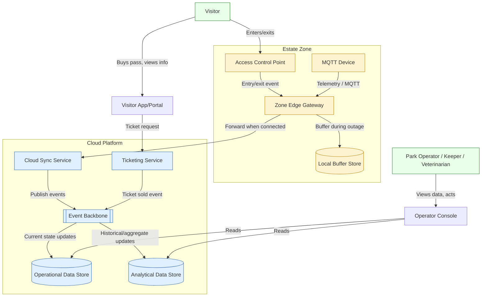

# Target state: baseline operational architecture

This document describes the **baseline operational architecture** — the system
that must exist and work reliably before any AI capability is added. It
deliberately excludes AI components; those are layered on top in
[../use-cases/](../use-cases/) and referenced from [../adrs/](../adrs/). This
separation follows the principle in `../AGENT-CONTEXT.md`: "design the baseline
operational system before adding AI."

Component names below are logical roles, not product or vendor names, per
`../AGENT-CONTEXT.md` and [../README.md](../README.md).

## Design goals

The baseline architecture must satisfy, at minimum:

- Ticketing and access control that work even when connectivity is degraded.
- Capture of MQTT telemetry from rides and enclosures across the estate.
- A visitor-facing app/portal and operator-facing interfaces.
- Local buffering at the edge so no zone's data is lost during a Wi-Fi outage.
- Reliable synchronisation from edge to cloud once connectivity returns.
- A clear separation between operational (transactional) data and analytical
  data, connected through an event backbone.

These map directly to the technical constraints (TC1–TC4) and offline/edge
requirements (OE1–OE4) in [../docs/requirements.md](../docs/requirements.md), and
support the resilience, data integrity and scalability characteristics in
[../docs/architecture-characteristics.md](../docs/architecture-characteristics.md).

## Logical components

| Component | Role |
|---|---|
| **Visitor App/Portal** | Visitor-facing channel for ticket purchase, entry passes, and (later) recommendations |
| **Ticketing Service** | Sells and validates individual/family passes (FR1) |
| **Access Control Point** | Physical entry/exit points that record visitor entry events (FR2) |
| **Operator Console** | Interface for park operators, keepers and veterinarians to view data and act (FR5, FR9) |
| **MQTT Device** | Sensor or actuator at a ride, enclosure or zone, publishing telemetry/events over MQTT |
| **Zone Edge Gateway** | Local component per zone that subscribes to MQTT traffic, buffers it durably, and forwards it to the cloud when connectivity allows (OE1) |
| **Local Buffer Store** | Durable local storage at the edge gateway holding unsent events during an outage |
| **Cloud Sync Service** | Receives forwarded edge data, handles ordering/deduplication, and publishes it onto the event backbone |
| **Event Backbone** | Cloud-side stream/bus carrying operational events (ticketing, entry, telemetry) to downstream consumers |
| **Operational Data Store** | Transactional store for current-state data (active tickets, current occupancy, open alerts) |
| **Analytical Data Store** | Store optimised for historical/aggregate analysis (attendance trends, past telemetry), decoupled from operational data |

## Target-state diagram

**Legend:** Yellow = zone/edge components (in the estate, subject to patchy
Wi-Fi). Blue = cloud platform components. Green = people. Rounded/cylinder shapes
represent data stores; the double-bracket shape represents the event backbone.

## How this satisfies the baseline requirements

- **Ticketing** is handled by the Ticketing Service, reachable through the
  Visitor App/Portal; ticket-sold events flow onto the Event Backbone so both
  operational and analytical stores stay consistent.
- **Entry/access** is captured at Access Control Points, which forward events
  through the same Zone Edge Gateway as other zone telemetry, so entry data is
  resilient to the same Wi-Fi gaps as ride/enclosure data.
- **Visitor app/portal** is the single visitor-facing channel, satisfying
  assumption V1 in [../docs/assumptions.md](../docs/assumptions.md).
- **Operator interfaces** are unified in the Operator Console, used by park
  operators, keepers and veterinarians (see
  [../docs/stakeholders-and-personas.md](../docs/stakeholders-and-personas.md)),
  reading from both operational and analytical stores depending on the task.
- **MQTT devices** publish locally within their zone (assumption M3 in
  [../docs/assumptions.md](../docs/assumptions.md)), never directly to the cloud.
- **Local edge gateway and buffering** ensure no zone depends on continuous
  Wi-Fi; see [data-flow.md](data-flow.md) for the detailed sequence during an
  outage.
- **Cloud synchronisation** is a distinct step (Cloud Sync Service) so ordering,
  deduplication and backpressure are handled explicitly rather than assumed away.
- **Operational vs analytical data** are kept as separate stores, connected only
  through the Event Backbone, so analytical workloads (including future AI) can
  never degrade transactional performance — directly supporting the resilience
  and scalability characteristics in
  [../docs/architecture-characteristics.md](../docs/architecture-characteristics.md).

## What is deliberately excluded here

No AI/ML component appears in this document. Once this operational backbone is in
place, the three AI use cases ([Visitor
Intelligence](../use-cases/visitor-intelligence.md), [Animal Health
Intelligence](../use-cases/animal-health-intelligence.md), [Personalised Visitor
Experience](../use-cases/personalised-visitor-experience.md)) consume events from
the Event Backbone and data from the Analytical Data Store, and publish
recommendations/alerts back through the Operator Console and Visitor App/Portal —
without changing the components described here.
