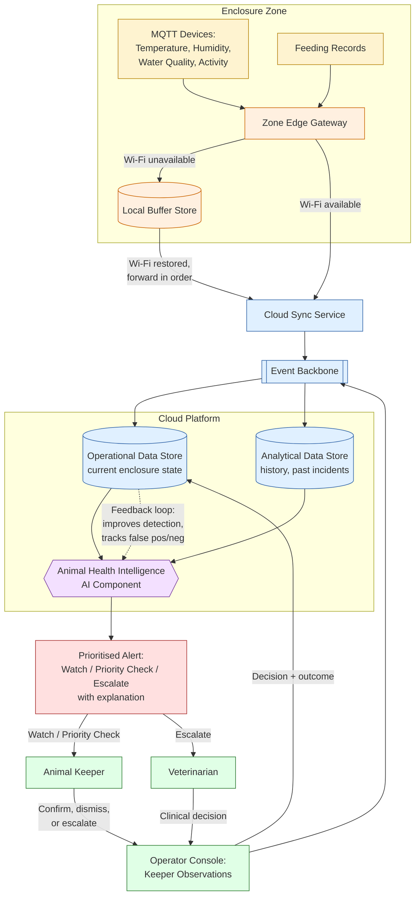

# Diagram: AI Animal Health Intelligence

This diagram supports
[../use-cases/animal-health-intelligence.md](../use-cases/animal-health-intelligence.md).
It uses simple boxes and arrows, consistent with the Mermaid conventions in
`../AGENT-CONTEXT.md`, and reuses component names from
[../architecture/target-state.md](../architecture/target-state.md),
[../architecture/data-flow.md](../architecture/data-flow.md) and
[../architecture/deployment-view.md](../architecture/deployment-view.md).

## Diagram

## Legend

| Shape / colour | Meaning |
|---|---|
| Yellow boxes | Sensor and feeding data captured at the enclosure |
| Orange boxes | Zone Edge Gateway and Local Buffer Store — buffer telemetry during Wi-Fi outages |
| Blue boxes / cylinders | Cloud Sync Service, Event Backbone and data stores |
| Purple hexagon | The Animal Health Intelligence AI component (anomaly detection, prioritisation, correlation hints) |
| Red box | A prioritised, explainable alert — never a diagnosis or treatment instruction |
| Green boxes | Keeper, veterinarian and the console they use to confirm, dismiss or escalate |
| Dashed arrow | Feedback loop: recorded decisions/outcomes are used to evaluate and improve the model, including tracking false positives and false negatives |

## Notes

- The buffering path (Gateway → Local Buffer Store → Cloud Sync Service) is
  shown explicitly because it is the mechanism that prevents telemetry loss
  during a Wi-Fi outage, per
  [../architecture/data-flow.md](../architecture/data-flow.md), Flow 3.
- The AI component only ever produces an **Alert**; it does not write back to
  any enclosure control, feeding system or safety mechanism, consistent with
  the requirement that AI must not make veterinary or safety decisions (see
  [../use-cases/animal-health-intelligence.md](../use-cases/animal-health-intelligence.md)).
- Escalate-level alerts reach both the keeper and the veterinarian; Watch and
  Priority-check alerts reach the keeper first, who may still escalate manually.
- The feedback loop is the same mechanism used to compute precision/recall and
  to trigger the model-disable process described in the use case document when
  quality degrades.
