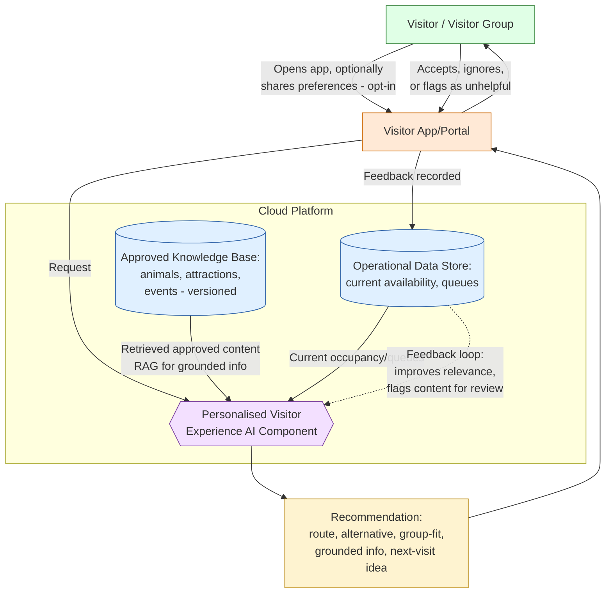

# Diagram: AI Personalised Visitor Experience

This diagram supports
[../use-cases/personalised-visitor-experience.md](../use-cases/personalised-visitor-experience.md).
It uses simple boxes and arrows, consistent with the Mermaid conventions in
`../AGENT-CONTEXT.md`, and reuses component names from
[../architecture/target-state.md](../architecture/target-state.md) and
[../architecture/security-and-privacy.md](../architecture/security-and-privacy.md).

## Diagram

## Legend

| Shape / colour | Meaning |
|---|---|
| Green box | The visitor or visitor group |
| Orange box | The Visitor App/Portal, the single channel between visitor and AI |
| Blue boxes / cylinders | Current operational data (reused from [Visitor Intelligence](../use-cases/visitor-intelligence.md)) and the approved, versioned knowledge base |
| Purple hexagon | The Personalised Visitor Experience AI component, using RAG only for grounded information delivery (see use case document) |
| Yellow box | The recommendation shown to the visitor, always labelled with what it is grounded in |
| Dashed arrow | Feedback loop: visitor feedback improves future recommendations and can flag knowledge-base content for review |

## Notes

- The Operational Data Store here is the same store described in
  [../architecture/target-state.md](../architecture/target-state.md) and used
  by [Visitor Intelligence](../use-cases/visitor-intelligence.md); it is not
  duplicated for this use case.
- The Approved Knowledge Base is maintained separately by estate staff, outside
  the MQTT/telemetry event flow, and is versioned so the AI component can
  indicate whether a piece of information is current (see the use case
  document, "Distinguishing current from outdated information").
- When the AI component or its data sources are degraded, the Visitor
  App/Portal shows static approved content or simple rule-based suggestions
  instead of a personalised recommendation, as described in the use case
  document's "Rule-based fallback" section; this fallback path is not shown as
  a separate branch here to keep the diagram focused on the primary flow.
- Every recommendation carries a visible way to flag it as unhelpful, which is
  what feeds the feedback loop shown with the dashed arrow.
