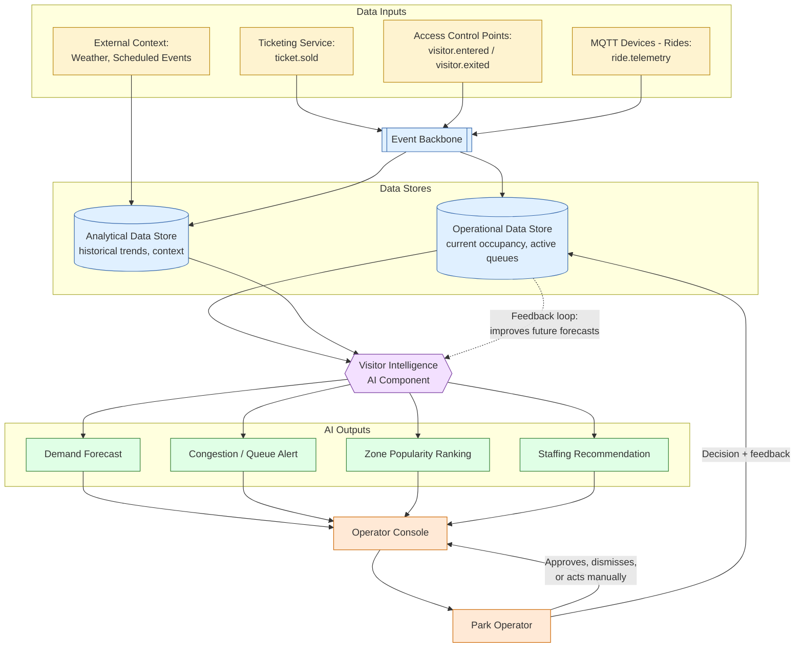

# Diagram: AI Visitor Intelligence

This diagram supports [../use-cases/visitor-intelligence.md](../use-cases/visitor-intelligence.md).
It uses simple boxes and arrows, consistent with the Mermaid conventions in
`../AGENT-CONTEXT.md`, and reuses the component names from
[../architecture/target-state.md](../architecture/target-state.md) and
[../architecture/event-driven-architecture.md](../architecture/event-driven-architecture.md).

## Diagram

## Legend

| Shape / colour | Meaning |
|---|---|
| Yellow boxes | Data inputs: estate event sources and external context |
| Blue boxes / cylinders | Event Backbone and data stores (operational and analytical) |
| Purple hexagon | The Visitor Intelligence AI component (behind a model/provider abstraction, see [../README.md](../README.md)) |
| Green boxes | AI outputs: recommendations and analysis, never direct system actions |
| Orange boxes | Human operator and the console they use |
| Dashed arrow | Feedback loop: operator decisions and outcomes feed back to improve future AI outputs |

## Notes

- The AI component only reads from the Operational and Analytical Data Stores;
  it never writes directly to ticketing, staffing or ride-control systems (see
  [../use-cases/visitor-intelligence.md](../use-cases/visitor-intelligence.md),
  "Operator decisions").
- The feedback loop (operator decision recorded back into the Operational Data
  Store) is what allows forecast and alert quality to be evaluated and improved
  over time, per AI4 in [../docs/requirements.md](../docs/requirements.md).
- When any data input is delayed or missing (for example, buffered during a
  Wi-Fi outage, see [../architecture/data-flow.md](../architecture/data-flow.md)),
  the AI component still produces outputs but marks them as reduced-confidence,
  as described in the use case document.
